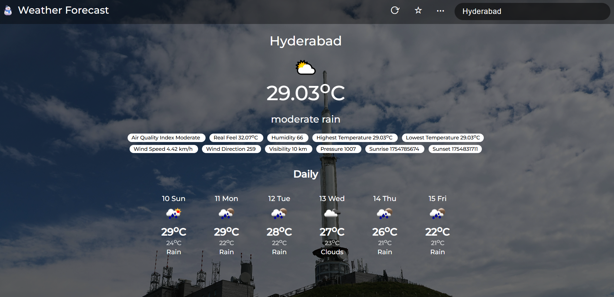
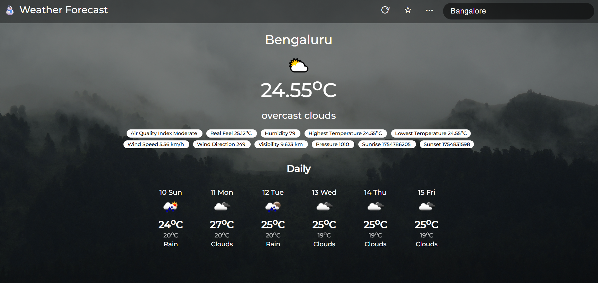
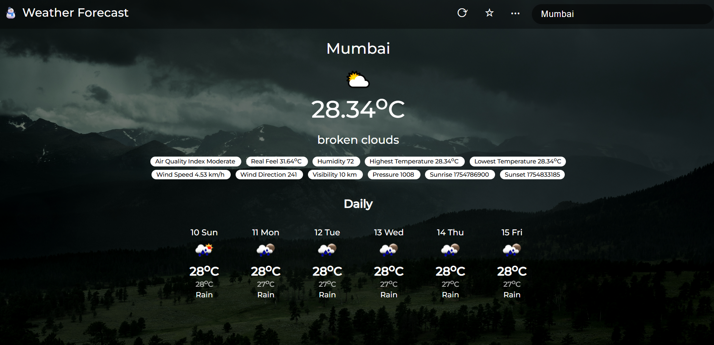
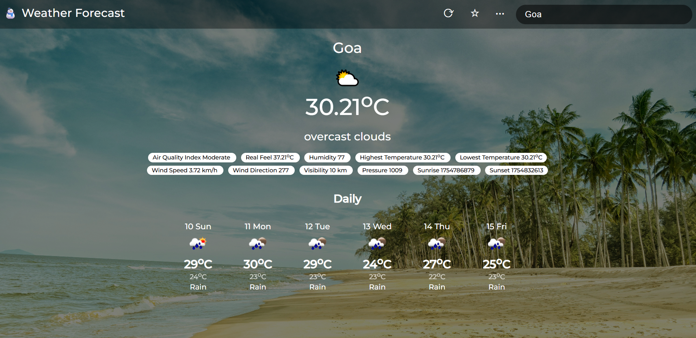
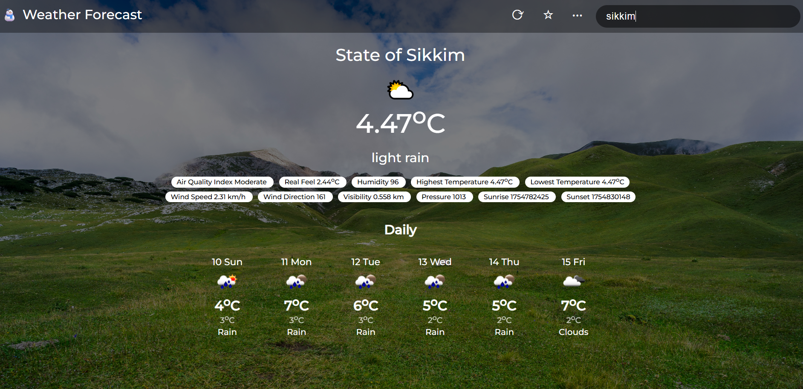
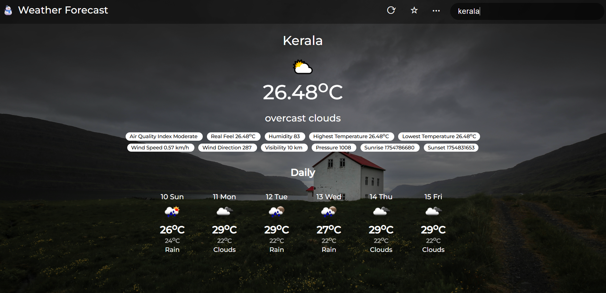

# ⛅ Weather Forecasting Website 

A **beautiful, real-time weather application** built with **Vanilla JavaScript** and powered by the **OpenWeatherMap API**.  

It displays:  
🌡 Current temperature  
💨 Wind speed & direction  
💧 Humidity  
🌅 Sunrise & 🌇 Sunset times  
📏 Visibility  
📉 Pressure  
🌤 5-day forecast with daily highs & lows  

---

## 🚀 Features
- **Real-time weather data** from OpenWeatherMap 🌍  
- **Automatic location detection** using browser geolocation 📍
- **Dynamic weather animations** - Rain, snow, clouds, lightning effects 🌧️❄️⛈️
- **Smart weather suggestions** - Clothing tips, activity recommendations 💡👕🎯
- **Voice search** - Say "What's the weather in London?" 🎙️
- **Weather notifications** - Daily weather summaries and alerts 🔔
- **Enhanced theme system** - Dark/light mode with user preference persistence 🌙☀️
- **Location management** - Saved favorites, recent searches, and location history 📍⭐🕐📊
- **Travelobia Assessment** - Comprehensive travel feasibility analysis ✈️🌍
- **Dynamic background images** that change based on weather conditions and time of day  
- **Detailed forecast** for upcoming days  
- **Responsive design** – works on desktop, tablet, and mobile 📱  
- **Minimal and clean UI**  

---

## ⚙️ Setup & Configuration
1. **Get an API Key** from [OpenWeatherMap](https://openweathermap.org/):
   - Create a free account or log in.
   - Go to **Profile → API Keys**.
   - Click **Generate Key** and copy it.

2. **Add your API Key** to the project:
   - Open `script.js`
   - Find:
     ```js
     const API_KEY = 'YOUR_API_KEY';
     ```
   - Replace `'YOUR_API_KEY'` with your actual API key.

---

## 📸 Screenshots

  
  
  
  
  
  

---

## 🛠 Technologies Used
- HTML5  
- CSS3  
- JavaScript (Vanilla)  
- [OpenWeatherMap API](https://openweathermap.org/api)

---

## ✈️ Travelobia Travel Assessment

The Travelobia feature provides comprehensive travel feasibility assessments by analyzing multiple factors:

### **🎯 Assessment Criteria**
- **Weather Conditions** (30% weight) - Current weather and temperature suitability
- **Political Safety** (40% weight) - U.S. travel advisories and safety levels
- **Cost Analysis** (30% weight) - Flight and accommodation costs for 7-day trips

### **📊 Scoring System**
- **75-100 points** ✅ **Good to Travel** - Optimal conditions for travel
- **50-74 points** ⚠️ **Better Not To** - Consider postponing or precautions
- **0-49 points** 🚫 **Don't Go** - High risk or unfavorable conditions

### **🌍 Pre-loaded Destinations**
- Paris, France
- Tokyo, Japan  
- London, United Kingdom
- Dubai, UAE
- New York, USA
- Bangkok, Thailand
- Cairo, Egypt
- Mexico City, Mexico
- Mumbai, India
- Moscow, Russia

### **🔧 Features**
- **Real-time weather integration** with OpenWeatherMap API
- **Political advisory integration** with safety scoring
- **Cost estimation** for flights and accommodations
- **Custom destination support** - Add your own locations
- **Detailed breakdown** of scoring factors
- **Direct weather access** from assessment results
- **Responsive design** for all devices
- **Mock API integration** - Simulates Node.js/Express backend
- **Database simulation** - MongoDB-like data persistence
- **Secure API patterns** - JWT tokens and authentication simulation

### **📱 How to Use**
1. Click the ✈️ **Travel Assessment** button in the navbar
2. Choose **"Assess All Destinations"** for comprehensive analysis
3. Or add **"Custom Destination"** for specific locations
4. View detailed scores and recommendations
5. Click **"Weather"** to see current conditions for any destination

---

## 📌 Future Improvements
- 📱 PWA support for offline use  
- 🎨 Advanced theme customization  
- 📊 More detailed hourly forecasts
- 🗺️ Weather maps and radar integration
- 🌐 Multi-language support
- 📈 Weather analytics and trends
- 🏨 Real-time hotel and flight pricing integration
- 🌍 Extended destination database

---

💙 **Developed by** [SAMITH RAJ](https://github.com/SAMITH-07)  
